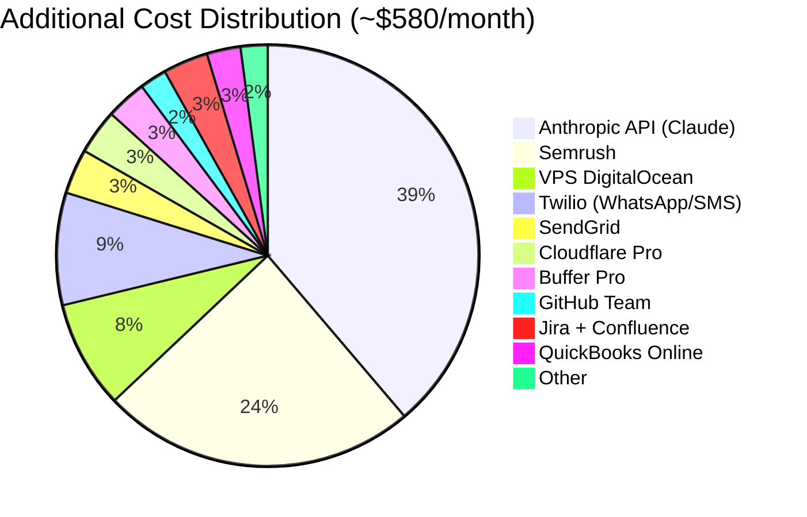

<div align="center">

# 🛠️ Complete Tech Stack
### All tools in the NTE-OpenClaw ecosystem

</div>

---

## Main AI Engine

| Tool | Function | Agents that use it |
|---|---|---|
| OpenClaw (Claude Code SDK) | Agent engine on VPS | All |
| Claude Opus 4 | LLM for complex decisions | Jarvis · David · T-800 |
| Claude Sonnet 4 | LLM for standard operations | 12 agents |
| Claude Haiku 4 | LLM for high-frequency tasks | HAL · R2-D2 · Marvin |

---

## Communication Hub

| Tool | Function | Cost |
|---|---|---|
| **Slack** | Central human-agent communication hub | $0 (initial free plan) |
| **Twilio** | WhatsApp Business + SMS | ~$50/month (pay-per-use) |
| **Meta API** | Facebook + Instagram Messenger | $0 |
| **Crisp** | Live chat on the website | $0-$25/month |

---

## 📧 Corporate Email — @nissienterprise.com

> ⚠️ **Gmail is NOT used** for any agent. All corporate emails use NTE's own server.

| Component | Detail |
|---|---|
| **Server** | mail.nissienterprise.com |
| **Domain** | @nissienterprise.com |
| **Send protocol** | SMTP/TLS — Port 587 |
| **Receive protocol** | IMAP/SSL — Port 993 |
| **Credentials** | Azure Key Vault → `secret/nte-email-smtp` |
| **Hosting provider** | NTE's own server (Plesk) |

### Agent Emails

| Agent | Email |
|---|---|
| Jarvis (NTE-MAIN) | jarvis@nissienterprise.com |
| Samantha (NTE-CX) | samantha@nissienterprise.com |
| WALL-E (NTE-CONTENT) | walle@nissienterprise.com |
| HAL (NTE-ANALYTICS) | hal@nissienterprise.com |
| Johnny 5 (NTE-TREND-SCOUT) | johnny5@nissienterprise.com |
| C-3PO (NTE-COPYWRITER) | c3po@nissienterprise.com |
| R2-D2 (NTE-PUBLISHER) | r2d2@nissienterprise.com |
| Baymax (NTE-PROPAGATOR) | baymax@nissienterprise.com |
| EVA (NTE-LEAD-INTAKE) | eva@nissienterprise.com |
| TARS (NTE-LEAD-NURTURE) | tars@nissienterprise.com |
| David (NTE-PM) | david@nissienterprise.com |
| Bishop (NTE-BACKEND) | bishop@nissienterprise.com |
| Sonny (NTE-FRONTEND) | sonny@nissienterprise.com |
| BB-8 (NTE-MOBILE) | bb8@nissienterprise.com |
| CASE (NTE-DATA) | case@nissienterprise.com |
| AVA (NTE-QA) | ava@nissienterprise.com |
| Optimus (NTE-DEVOPS) | optimus@nissienterprise.com |
| T-800 (NTE-SECURITY) | t800@nissienterprise.com |
| Marvin (NTE-DOCS) | marvin@nissienterprise.com |

---

## Project & Task Management

> ✅ **Official stack: Jira** — It is NTE's sole tool for tracking projects and sprints.

| Tool | Function | Cost |
|---|---|---|
| **Jira** | Task, sprint, epic, and project tracking | $10/user/month |
| **Jira Automation** | Automatic workflow rules | Included |
| **Confluence** | Team wiki and technical documentation | $5/user/month |

### Jarvis ↔ Jira Integration

- **David (NTE-PM)** creates and manages all Jira tickets automatically.
- **Jarvis** checks Jira status for weekly reports to Michael.
- **AVA (NTE-QA)** updates tickets with testing results.
- **Optimus (NTE-DEVOPS)** automatically closes tickets upon completing deployments.
- **T-800 (NTE-SECURITY)** creates security tickets classified `CRITICAL` or `HIGH`.

```
Jira Workspace:   https://[nte-workspace].atlassian.net
API Token:        Azure Key Vault → secret/jira-api-token
Projects:
  NTE-SW  → Software R&D Wing (sprints)
  NTE-MKT → Blog & Marketing
  NTE-OPS → Operations & Infrastructure
  NTE-SEC → Security
```

---

## 💼 Finance — QuickBooks

QuickBooks Online integration for NTE's automated financial management.

| Function | Responsible Agent | Requires Michael's Approval |
|---|---|---|
| Generate client invoice | TARS (draft) → Jarvis (send) | ✅ Yes |
| Generate estimate/quote | Jarvis | ✅ Yes |
| View accounts receivable status | Jarvis | ❌ No |
| Report monthly revenue | HAL (NTE-ANALYTICS) | ❌ No |
| Overdue payment reminder | TARS | ✅ Yes (first send) |

```
QuickBooks:    Online (cloud)
API:           QuickBooks Online REST API v3
OAuth Token:   Azure Key Vault → secret/quickbooks-oauth-token
Environment:   Sandbox (Dev/Staging) · Production (Prod)
```

> ⚠️ **Golden rule:** No agent can send an invoice or collect payment without Michael's explicit approval. Jarvis always escalates via `#nte-alerts` before executing any financial transaction.

---

## 📅 Calendar — Google Calendar + NTE-Calendar

| Component | Detail |
|---|---|
| **Platform** | Google Calendar |
| **Main calendar** | NTE-Calendar (shared with Michael) |
| **API Token** | Azure Key Vault → `secret/google-calendar-token` |
| **Agents with access** | Jarvis, David, Samantha |

### Uses by Agent

- **Jarvis** → Schedules roadmap milestones, sprint review meetings
- **David** → Plans sprints, project deadlines in NTE-Calendar
- **Samantha** → Schedules appointments with clients and prospects directly in NTE-Calendar

---

## Development & DevOps

> ✅ **All repositories live on GitHub.**

| Tool | Function | Cost |
|---|---|---|
| **GitHub** | Version control + Code Review (all repos) | $4/user |
| **GitHub Actions** | Automatic CI/CD pipelines | Included |
| **Docker + Compose** | Containerization for each agent | $0 |

### GitHub Repository Structure

```
GitHub Org: github.com/[NTE-org]
├── openclaw-nte          ← This repo (config & documentation)
├── nte-[client]-[app]    ← Client projects
├── nte-infra             ← Infrastructure scripts
└── nte-agents-docker     ← Dockerfiles for each agent
```

### Branches by Environment

| Branch | Environment | Protected |
|---|---|---|
| `develop` | Development | ❌ Free push |
| `staging` | Staging | ✅ PR required |
| `main` | Production | ✅ PR + AVA approved + T-800 clear |

---

## 🐳 Docker — One Container per Agent

Each sub-agent has its own Dockerfile in `nte-agents-docker`:

```
nte-agents-docker/
├── samantha/      ← NTE-CX
├── walle/         ← NTE-CONTENT
├── hal/           ← NTE-ANALYTICS
├── johnny5/       ← NTE-TREND-SCOUT
├── c3po/          ← NTE-COPYWRITER
├── r2d2/          ← NTE-PUBLISHER
├── baymax/        ← NTE-PROPAGATOR
├── eva/           ← NTE-LEAD-INTAKE
├── tars/          ← NTE-LEAD-NURTURE
├── david/         ← NTE-PM
├── bishop/        ← NTE-BACKEND
├── sonny/         ← NTE-FRONTEND
├── bb8/           ← NTE-MOBILE
├── case/          ← NTE-DATA
├── ava/           ← NTE-QA
├── optimus/       ← NTE-DEVOPS
├── t800/          ← NTE-SECURITY
└── marvin/        ← NTE-DOCS
```

---

## 🔐 Secrets Security — Azure Key Vault

> ✅ **All secrets live in Azure Key Vault.** Zero passwords in code or in this repository.

| Component | Detail |
|---|---|
| **Service** | Azure Key Vault |
| **Vault Name** | `nte-keyvault` |
| **Access** | Only Jarvis has direct access (Managed Identity) |
| **Rotation** | Automatic every 90 days (by T-800) |

```bash
# Example: Retrieve secret from Jarvis
az keyvault secret show \
  --name "anthropic-api-key" \
  --vault-name "nte-keyvault" \
  --query "value" -o tsv
```

---

## Marketing & Content

| Tool | Function | Cost |
|---|---|---|
| **WordPress REST API** | Blog publishing | $0 |
| **Buffer Pro** | Social media scheduling | $18/month |
| **Semrush** | SEO research + keywords | $140/month |
| **SendGrid** | Email marketing + newsletter | $20/month |
| **DALL-E API** | AI-generated images | ~$0.04/image |

---

## Analytics & BI

| Tool | Function | Cost |
|---|---|---|
| **Google Analytics 4** | Web metrics | $0 |
| **Search Console** | SEO performance | $0 |
| **Metabase** | BI dashboards | $0 (self-hosted) |
| **Looker Studio** | Executive reports | $0 |

---

## Hosting Infrastructure

| Tool | Function | Cost |
|---|---|---|
| **DigitalOcean** | Main VPS (OpenClaw) | ~$48/month |
| **Cloudflare** | WAF + DDoS + SSL | $20/month |
| **Fail2Ban** | VPS protection | $0 |
| **Plesk** | Client app hosting + @nissienterprise.com email | Already in place |

---

## Estimated Monthly Cost Summary



---

[← Back to home](../README.md) | [Roadmap →](../06-roadmap/implementation-2026.md)
