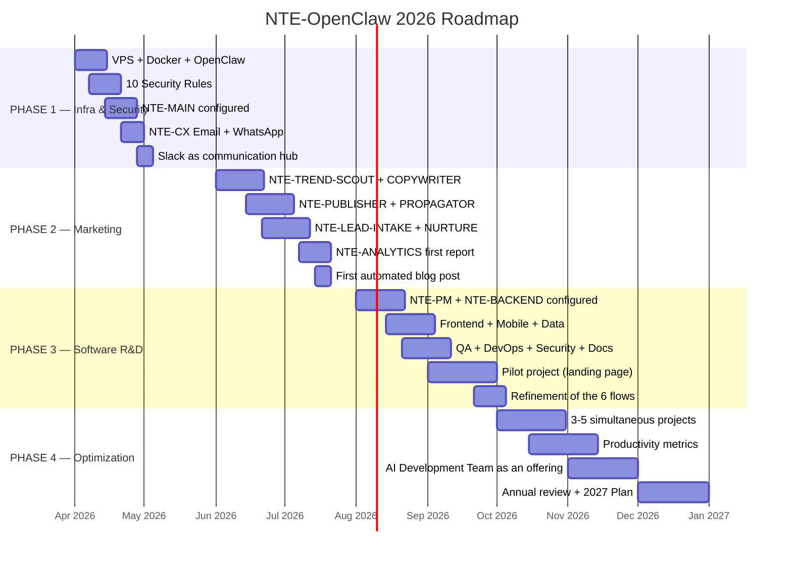

# 🗓️ 2026 Implementation Roadmap
### 4 Phases · April → December

## Key Milestones

| Date | Milestone | Success Indicator |
|---|---|---|
| **April 30** | OpenClaw secure and operational | NTE-MAIN responds in Slack |
| **May 31** | NTE-CX active on all channels | First lead responded to automatically |
| **July 15** | Blog automation operational | First article published automatically |
| **August 1** | Lead pipeline functioning | 10 leads processed without manual intervention |
| **September 30** | Software pilot completed | Landing page delivered to a real client |
| **November 30** | 3 simultaneous active projects | Additional revenue covering costs |
| **December 31** | Annual review and 2027 plan | ROI > 300% on automation investment |

## Success Criteria by Phase

### ✅ PHASE 1 — Infrastructure (April-May)
- [ ] VPS with Ubuntu 22.04 operational
- [ ] The 10 security rules applied and verified
- [ ] NTE-MAIN responding to Michael's commands in Slack
- [ ] NTE-CX responding to email and WhatsApp messages < 5 min
- [ ] First lead captured and logged in CRM

### ✅ PHASE 2 — Marketing (June-July)
- [ ] First blog article published automatically
- [ ] Social media adaptations scheduled via Buffer
- [ ] Lead pipeline active on all channels
- [ ] Automated weekly Google Analytics report
- [ ] Monthly newsletter sent automatically

### ✅ PHASE 3 — Software R&D (August-September)
- [ ] All 9 development agents configured and communicating
- [ ] GitHub Actions with CI/CD working
- [ ] Pilot project completed and delivered to the client
- [ ] Playbooks documented for each agent

### ✅ PHASE 4 — Optimization (October-December)
- [ ] 3+ software projects running in parallel
- [ ] AI Development Team launched as a commercial offering
- [ ] ROI calculated and documented
- [ ] 2027 Plan ready

[← Tech Stack](../05-tech-stack/tools.md) | [Prompts →](../07-prompts/nte-main-system-prompt.md)
