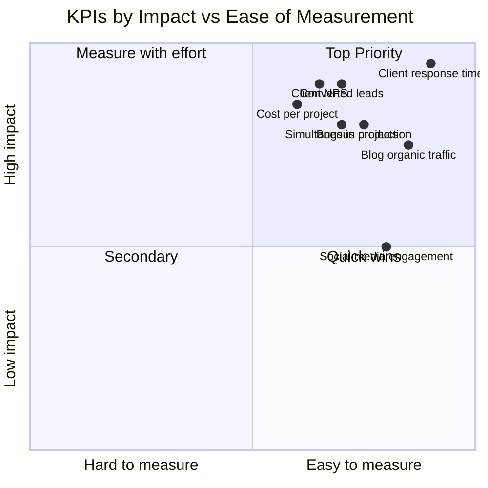
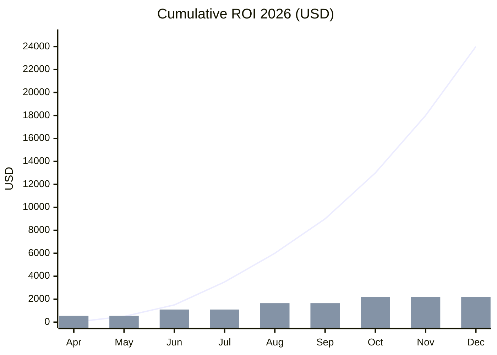

<div align="center">

# 📊 KPIs & Success Metrics
### The NTE-OpenClaw 2026 Control Dashboard

</div>

## Main KPI Dashboard



## Administrative KPIs

| KPI | Baseline | 2026 Target | Responsible Agent | Frequency |
|---|---|---|---|---|
| ⏱️ Client response time | Days | **< 5 minutes** | NTE-CX | Real time |
| ✅ Inquiries resolved without escalation | 0% | **> 70%** | NTE-CX | Weekly |
| 📝 Blog articles published | 0/month | **8/month** | NTE-COPYWRITER | Monthly |
| 📈 Organic traffic (GA4) | Current baseline | **+15%/month** | NTE-ANALYTICS | Weekly |
| 📱 Social media engagement | Current baseline | **+20%/month** | NTE-PROPAGATOR | Weekly |
| 📧 Newsletter open rate | - | **> 25%** | NTE-CONTENT | Monthly |
| 🔑 Top 10 Google keywords | Current baseline | **+5 keywords/month** | NTE-ANALYTICS | Monthly |

## Lead Management KPIs

| KPI | Target | Agent | Note |
|---|---|---|---|
| ⚡ First contact time | < 5 min | NTE-LEAD-INTAKE | 24/7 |
| 🔄 COLD → WARM conversion | > 20% in 30 days | NTE-LEAD-NURTURE | |
| 🔥 WARM → HOT conversion | > 15% in 14 days | NTE-LEAD-NURTURE | |
| 💰 HOT leads closed | > 30% | Michael + NTE-PM | |
| 📊 Qualified leads/month | > 20 | NTE-LEAD-INTAKE | |

## Software R&D KPIs

| KPI | Baseline | 2026 Target | Responsible Agent |
|---|---|---|---|
| ⏰ Delivery time per project | 100% | **60% reduction** | NTE-PM |
| 💰 Labor cost per project | 100% | **70% reduction** | All dev agents |
| 🐛 Bugs in production | - | **< 2% of features** | NTE-QA |
| 🧪 Test coverage | - | **> 80%** | NTE-QA |
| 📦 Simultaneous projects | 1-2 | **5+ by Q4 2026** | NTE-PM |
| ⭐ Client NPS | - | **> 8/10** | NTE-PM + NTE-CX |
| 🔐 Production vulnerabilities | - | **0 critical** | NTE-SECURITY |

## Projected ROI



*Line: Cumulative savings/revenue. Bars: Additional monthly automation cost.*

## Automatic Weekly Report (example)

```
📊 NTE WEEKLY REPORT — Week of Mar 28, 2026

🟢 MARKETING
  • Blog: 2 articles published ✓ | Traffic: +12% vs previous week
  • Social media: 35 posts scheduled | Average engagement: 4.2%
  • Newsletter: 847 subscribers | Open rate: 28.3%

🟡 LEADS
  • Leads received: 14 | HOT: 3 | WARM: 7 | COLD: 4
  • Avg. response time: 3.2 min ✓
  • 2 HOT leads escalated to Michael (follow-up pending)

🟢 SOFTWARE R&D
  • Active projects: 2 | Sprints in progress: 2
  • PRs merged: 23 | Bugs detected: 4 | Bugs resolved: 4
  • NTE-SECURITY: 0 critical vulnerabilities this week

🟡 INFRASTRUCTURE
  • VPS: 98.7% uptime | API Cost: $187/month (within budget)
  • Alert: Semrush subscription expires in 12 days — renew

⚡ ACTIONS REQUIRED FROM MICHAEL:
  1. Review 2 draft blog articles (link)
  2. Contact HOT lead: Ana García / García Dental (WhatsApp)
  3. Approve $3,200 budget for client López Marketing
```

[← Prompts](../07-prompts/nte-main-system-prompt.md) | [Budget →](../09-budget/estimated-costs.md)
