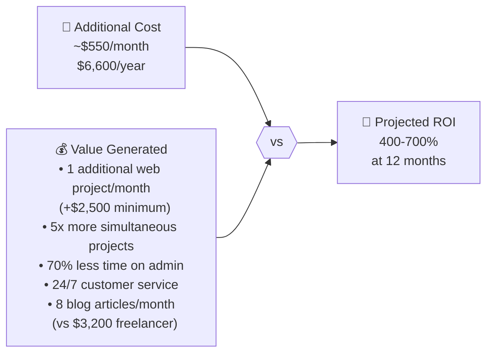

# 💰 Budget & ROI
### Automation Investment vs. Expected Return

## Additional Monthly Costs

| Category | Tool | Cost/Month | Notes |
|---|---|---|---|
| ☁️ Infrastructure | DigitalOcean VPS 4vCPU/8GB | $48 | Sufficient to start |
| 🤖 AI | Anthropic API (Claude) | ~$150-300 | Depends on token volume |
| 🔧 DevOps | GitHub Team | $12 | 3 users × $4 |
| 📱 Marketing | Buffer Pro | $18 | Up to 100 social channels |
| 🔍 SEO | Semrush Starter | $140 | Can be downgraded to basic plan |
| 📧 Email | SendGrid Essentials | $20 | Up to 100K emails/month |
| 🗂️ PM/CRM | Jira Standard | $30 | 3 users × $10 |
| 🔒 Security | Cloudflare Pro | $20 | Basic WAF + DDoS |
| 🔐 Secrets | HashiCorp Vault Cloud | $0 | Free plan available |
| 💬 Communication | Twilio (WhatsApp + SMS) | ~$50 | Pay-as-you-go |
| **TOTAL** | | **~$488-638/month** | |

## Expected ROI

## Break-Even Point

> **A single additional web project per month ($1,800-$3,500) covers the full cost of the entire automation infrastructure.**

With the system active, NTE can handle **5x more projects** without hiring additional staff.

## Additional Revenue Projection

| Source | Monthly Projection (Q4 2026) |
|---|---|
| Additional web projects (×2) | +$5,000 |
| Software projects (×1 additional) | +$8,000 |
| Leads converted through automation | +$3,000 |
| Savings on freelance marketing | +$3,200 |
| **Estimated additional total** | **+$19,200/month** |

*Monthly investment: ~$550 → ROI: ~3,400%*

## API Cost Optimization

To stay within the $150-$300/month API range:

| Strategy | Impact |
|---|---|
| Use Haiku for high-frequency tasks | -40% of total cost |
| Cache common responses in NTE-CX | -15% |
| Token limits per agent | -10% |
| Automatic alert to Michael if it exceeds $400 | Prevents surprises |

[← KPIs](../08-kpis/success-metrics.md) | [Back to home](../README.md)
