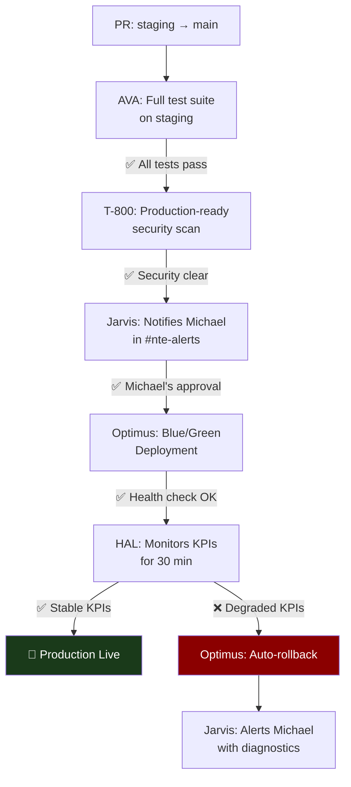

<div align="center">

# 🌿 The System's 3 Environments
### Development · Staging · Production

> **Golden rule:** Never skip an environment. Never test directly in Production.

</div>

---

## Overview

```mermaid
flowchart LR
    subgraph DEV["🔧 DEVELOPMENT\nFake Data · Branch: develop"]
        D1["Configure agents"]
        D2["Test flows\nwith fictitious data"]
        D3["Debug\nintegrations"]
    end

    subgraph STG["🧪 STAGING\nReal Data · Branch: staging"]
        S1["Automated tests\n(AVA)"]
        S2["Demos for Michael\nand clients"]
        S3["Validation with\nreal data"]
    end

    subgraph PROD["🚀 PRODUCTION\nReal Data · Branch: main"]
        P1["System live\n24/7"]
        P2["Active agents\nwith real clients"]
        P3["Continuous\nmonitoring (HAL)"]
    end

    DEV -->|"PR develop → staging\n✅ Approved by AVA"| STG
    STG -->|"PR staging → main\n✅ Approved by AVA + T-800\n✅ Sign-off from Michael"| PROD

    style DEV fill:#1a3a5c,color:#fff
    style STG fill:#2c1654,color:#fff
    style PROD fill:#1a3a1a,color:#fff
```



---

## Comparison Table

| Feature | Development | Staging | Production |
|---|---|---|---|
| **Purpose** | Development and configuration | Testing and demos | Live system |
| **Data** | Fake data / fixtures | Real data | Real data |
| **Git Branch** | `develop` | `staging` | `main` |
| **Internal URL** | dev.nte-internal.com | staging.nte-internal.com | prod.nte-internal.com |
| **Michael's access** | Free | By invitation | Read only |
| **Active agents** | Selected | All | All |
| **QuickBooks** | Sandbox mode | Sandbox mode | Production |
| **Jira** | NTE-DEV project | NTE-STG project | Real projects |
| **Email** | dev@... (doesn't actually send) | Real staging (sends) | @nissienterprise.com |
| **GitHub Actions** | Basic tests | Full test suite | Deploy blocked until approval |
| **Azure Key Vault prefix** | `dev/` | `staging/` | `prod/` |
| **Docker** | Local containers | Containers on staging VPS | Containers on prod VPS |

---

## 🔧 DEVELOPMENT

**Goal:** Where we build and break things. No fear. With fake data.

### When to use Development

- Configuring a new agent for the first time
- Testing a new integration (QuickBooks, Jira, etc.)
- Developing and testing new workflows
- Experimenting with agent prompts
- Debugging errors in an existing flow

### Development Rules

- Data is **100% fake** — never real client data
- Agents can fail without consequences
- Emails don't go out externally (use mailtrap or redirect to test@nissienterprise.com)
- QuickBooks in **sandbox mode** — no real transactions
- GitHub branch: `develop` — free push, no protection
- Jira tickets are in the `NTE-DEV` project

### Secrets Configuration for Development

```bash
# Prefix: dev/ in Azure Key Vault
VAULT="nte-keyvault"

# Dev secrets use sandbox/test accounts
az keyvault secret set --vault-name $VAULT \
  --name "dev/anthropic-api-key" --value "sk-ant-[dev-key]"

az keyvault secret set --vault-name $VAULT \
  --name "dev/quickbooks-oauth-token" --value "[sandbox-token]"

az keyvault secret set --vault-name $VAULT \
  --name "dev/nte-email-smtp-user" --value "test@nissienterprise.com"
```

### Activate the Development environment

```bash
export NTE_ENV=development
export AKV_PREFIX=dev

# Load dev secrets
source /workspace/scripts/load-secrets.sh

# Bring up agents in dev mode
docker-compose -f docker-compose.dev.yml up
```

---

## 🧪 STAGING

**Goal:** The most important environment. Here we validate that everything works with real data before going to Production.

### When to use Staging

- Before every deployment to Production
- For demos to Michael or potential clients
- To run AVA's full test suite
- To validate that integrations work with real data
- To run load or stress tests on the agents

### Staging Rules

- Uses **real data** but in a controlled environment
- Emails **are actually sent** — use with caution
- QuickBooks in **sandbox mode** — no real transactions that affect accounting
- GitHub branch: `staging` — requires a **Pull Request** from `develop`
- Jira tickets are in the `NTE-STG` project
- AVA must run and approve the test suite before any merge
- T-800 must run a security scan before approving the PR

### PR Flow for Staging

```
develop → staging (Pull Request)
  ✅ AVA: Automated tests pass
  ✅ T-800: Clean security scan
  ✅ Optimus: Successful deployment on staging VPS
  → Merge approved by David or Jarvis
```

### Secrets Configuration for Staging

```bash
# Prefix: staging/ in Azure Key Vault
VAULT="nte-keyvault"

# Staging uses real accounts but in sandbox mode where applicable
az keyvault secret set --vault-name $VAULT \
  --name "staging/anthropic-api-key" --value "sk-ant-[staging-key]"

az keyvault secret set --vault-name $VAULT \
  --name "staging/quickbooks-oauth-token" --value "[sandbox-token]"

# Email does work in staging
az keyvault secret set --vault-name $VAULT \
  --name "staging/nte-email-smtp-user" --value "staging@nissienterprise.com"
```

### Activate the Staging environment

```bash
export NTE_ENV=staging
export AKV_PREFIX=staging

# Load staging secrets
source /workspace/scripts/load-secrets.sh

# Bring up agents in staging mode
docker-compose -f docker-compose.staging.yml up
```

---

## 🚀 PRODUCTION

**Goal:** The live system. This is where agents work with real clients and real data. Maximum stability.

### When deployment to Production happens

- Only from `staging` via Pull Request
- Requires explicit approval from Michael in `#nte-alerts`
- AVA must have run the complete test suite on staging
- T-800 must have given security clearance
- Optimus executes the deployment (never manually)
- Only during low-traffic hours (11 PM - 5 AM EST)

### Production Rules

- **Read only** for Michael — no manual changes are made
- All secrets use the real production accounts
- QuickBooks in **Production mode** — transactions are real
- GitHub branch: `main` — **fully protected**
- Zero-downtime deployment (blue/green or rolling update)
- Automated rollback if HAL detects KPI degradation

### Production Deployment Flow



### Secrets Configuration for Production

```bash
# Prefix: prod/ in Azure Key Vault
VAULT="nte-keyvault"

# Production uses all real accounts
az keyvault secret set --vault-name $VAULT \
  --name "prod/anthropic-api-key" --value "sk-ant-[prod-key]"

az keyvault secret set --vault-name $VAULT \
  --name "prod/quickbooks-oauth-token" --value "[production-token]"

az keyvault secret set --vault-name $VAULT \
  --name "prod/nte-email-smtp-user" --value "jarvis@nissienterprise.com"
```

---

## 📋 Naming Convention by Environment

To avoid confusion between environments, all resources follow this convention:

| Resource | Development | Staging | Production |
|---|---|---|---|
| Docker containers | `nte-dev-[agent]` | `nte-stg-[agent]` | `nte-[agent]` |
| Jira projects | `NTE-DEV-*` | `NTE-STG-*` | `NTE-SW-*` / `NTE-MKT-*` |
| GitHub branches | `develop` | `staging` | `main` |
| Azure KV secrets | `dev/[secret]` | `staging/[secret]` | `prod/[secret]` |
| Logs directory | `/workspace/logs/dev/` | `/workspace/logs/stg/` | `/workspace/logs/prod/` |
| Email sender | `dev@nissienterprise.com` | `staging@nissienterprise.com` | `[agent]@nissienterprise.com` |

---

## 🔐 Access by Environment

| Who | Development | Staging | Production |
|---|---|---|---|
| **Michael** | Full access | Full access | Read only + approvals |
| **Jarvis** | Full access | Full access | Full access (orchestrator) |
| **David** | Full access | Full access | Read + ticket management |
| **Optimus** | Full access | Full access | Deploy + monitoring only |
| **T-800** | Full access | Full access | Security scan + read |
| **Other agents** | Per task | Per task | Their scope only |

---

[← Back to home](../README.md) | [Tech Stack →](../05-tech-stack/tools.md)
