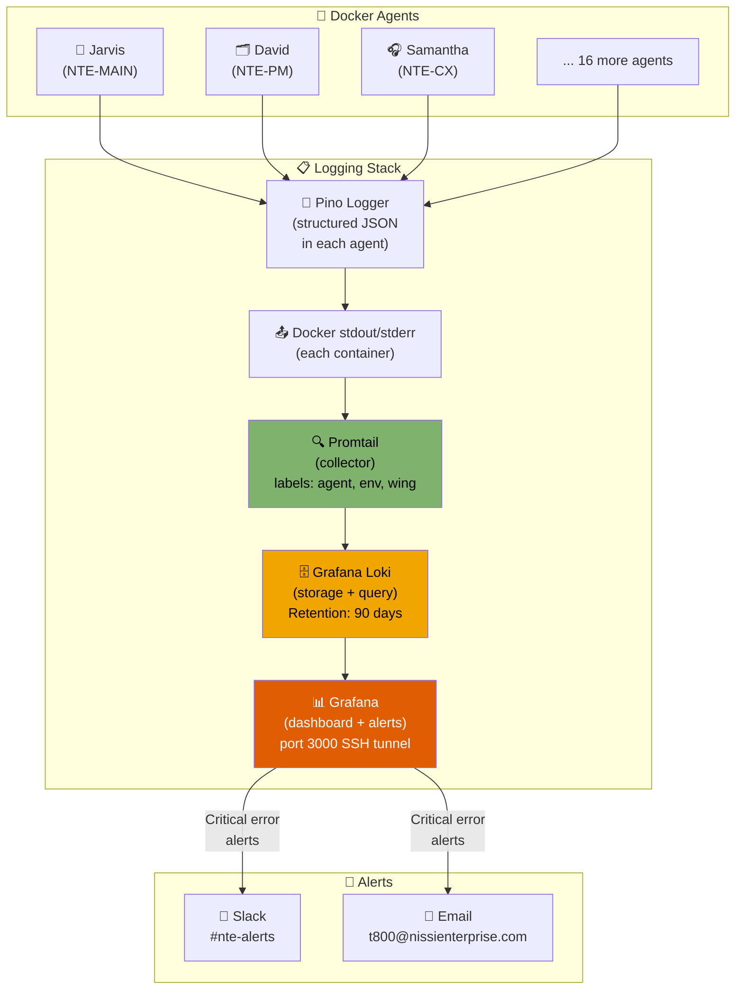

<div align="center">

# 📋 NTE Logging System
### Total Observability of the Agent Ecosystem

> *"If you can't measure it, you can't improve it."*

</div>

---

## Technology Stack

```
┌──────────────────────────────────────────────────────────────┐
│                     LOGGING STACK NTE                        │
│                                                              │
│  🤖 Docker Agents ──► 📤 Promtail ──► 🗄️ Loki ──► 📊 Grafana │
│  (stdout JSON)         (collector)    (storage)  (dashboard) │
│                                                              │
│  + Pino (logger in each agent — structured JSON output)      │
└──────────────────────────────────────────────────────────────┘
```

| Component | Role | Port | Resource |
|---|---|---|---|
| **Pino** | JSON logger in each agent | — | ~0 MB overhead |
| **Promtail** | Collects logs from Docker | — | ~50 MB RAM |
| **Loki** | Stores and queries logs | 3100 (internal) | ~200 MB RAM |
| **Grafana** | Dashboard and alerts | 3000 (SSH tunnel) | ~150 MB RAM |

**Total logging system overhead: ~400 MB RAM** — very acceptable for an 8 GB VPS.

---

## Why This Stack?

| Alternative | RAM required | Why NOT? |
|---|---|---|
| ELK Stack (Elasticsearch) | 4-8 GB | Doesn't fit on the VPS alongside 19 Docker agents |
| Datadog | $15+/host/month | Unnecessary cost given everything we already have |
| CloudWatch | Depends on usage | AWS lock-in, expensive at high volume |
| **Loki + Grafana ✅** | ~400 MB | Lightweight, Docker-native, open source, powerful |

---

## Logging System Architecture



---

## Log Schema — Each Entry Records:

```json
{
  "timestamp":    "2026-03-29T10:30:00.123Z",
  "trace_id":     "a3f9-bc12-...",       // Unique ID linking an ENTIRE multi-agent flow
  "span_id":      "f1e2-4d89-...",       // ID for this specific operation
  "level":        "INFO",                // DEBUG | INFO | WARN | ERROR | CRITICAL
  "event_type":   "ACTION",             // See event types table below
  "agent_name":   "Jarvis",             // Character name
  "agent_id":     "NTE-MAIN",           // Technical ID
  "agent_email":  "jarvis@nissienterprise.com",
  "wing":         "orchestrator",        // orchestrator | administrative | software | blog | leads
  "environment":  "production",          // development | staging | production
  "message":      "Delegating blog pipeline to Johnny 5",
  "details": {
    "target_agent": "NTE-TREND-SCOUT",
    "input": "weekly_blog_trigger",
    "output": null
  },
  "duration_ms":  142,                   // Time the operation took
  "status":       "success",             // success | failure | pending | escalated
  "triggered_by": "heartbeat",           // heartbeat | michael | [agent_id] | webhook
  "parent_trace": null                   // trace_id of the parent flow (if invoked by another agent)
}
```

### Event Types (`event_type`)

| Type | Description | Example |
|---|---|---|
| `HEARTBEAT` | Scheduled task executed | Jarvis triggers Johnny 5 on Mondays at 2AM |
| `ACTION` | Agent executes an internal action | C-3PO drafts an article |
| `COMMAND` | Agent executes a system command | Optimus runs `docker restart` |
| `API_CALL` | Call to an external API | TARS calls the QuickBooks API |
| `INTER_AGENT` | One agent invokes another | David assigns a task to Bishop |
| `DECISION` | Agent makes a decision | EVA classifies a lead as HOT |
| `ESCALATION` | Agent escalates to Michael | Jarvis alerts in #nte-alerts |
| `SECRET_ACCESS` | Access to Azure Key Vault | Jarvis retrieves a credential |
| `JIRA_EVENT` | Operation in Jira | David creates ticket NTE-SW-142 |
| `QB_EVENT` | Operation in QuickBooks | Jarvis drafts invoice #INV-001 |
| `EMAIL_SENT` | Email sent from an agent | Samantha replies to a customer |
| `DEPLOY` | Deployment executed | Optimus deploys to staging |
| `SECURITY_SCAN` | Security scan | T-800 reports a vulnerability |
| `ERROR` | Non-fatal error | Johnny 5 fails to access Semrush |
| `CRITICAL` | Critical error, requires attention | T-800 detects an intrusion |

---

## Promtail Labels (for filtering in Grafana)

Each log entry has these automatic labels that allow filtering:

| Label | Possible values |
|---|---|
| `agent` | jarvis, samantha, walle, hal, johnny5, c3po, r2d2, baymax, eva, tars, david, bishop, sonny, bb8, case, ava, optimus, t800, marvin |
| `agent_id` | NTE-MAIN, NTE-CX, NTE-PM, etc. |
| `wing` | orchestrator, administrative, software, blog, leads |
| `environment` | development, staging, production |
| `level` | DEBUG, INFO, WARN, ERROR, CRITICAL |
| `event_type` | ACTION, COMMAND, API_CALL, INTER_AGENT, DECISION, ESCALATION, ERROR, CRITICAL... |

---

## Dashboards Available in Grafana

| Dashboard | Description |
|---|---|
| **NTE Overview** | General view — all agents, errors, real-time activity |
| **NTE by Agent** | Drilldown of a specific agent — all of its actions |
| **NTE Flows (Traces)** | Visualize a complete workflow using the `trace_id` |
| **NTE Errors** | Only ERROR and CRITICAL logs across all agents |
| **NTE API Calls** | All calls to external APIs (QuickBooks, Jira, GitHub, etc.) |
| **NTE Escalations** | History of all escalations to Michael |
| **NTE Security** | T-800 logs — security scans, Azure KV access |

---

## Accessing Grafana

```bash
# From your local machine — SSH tunnel
ssh -L 3000:localhost:3000 openclaw@YOUR_VPS_IP

# Then in the browser:
# http://localhost:3000
# User: admin
# Password: [Azure Key Vault → secret/grafana-admin-password]
```

---

## Logging System Files

```
workspace/logging/
├── nte-logger.js              ← Central logger (import in each agent)
├── docker-compose.logging.yml ← Full stack: Loki + Grafana + Promtail
├── loki-config.yml            ← Loki configuration (90-day retention)
├── promtail-config.yml        ← Docker log collection per agent
└── grafana/
    ├── provisioning/
    │   ├── datasources/
    │   │   └── loki.yml       ← Loki as a Grafana datasource
    │   └── dashboards/
    │       └── dashboards.yml ← Dashboard auto-load
    └── dashboards/
        └── nte-overview.json  ← Main NTE dashboard
```

---

## Useful Commands

```bash
# View real-time logs for a specific agent
docker logs -f nte-samantha

# Query in Loki via CLI (LogQL)
# All errors from the last 24h
logcli query '{environment="production"} |= "ERROR"' --since=24h

# Logs for a specific trace_id (follow a flow)
logcli query '{environment="production"} |= "a3f9-bc12"'

# All of Jarvis's logs today
logcli query '{agent="jarvis", environment="production"}'

# View escalations from the last 2h
logcli query '{event_type="ESCALATION"}' --since=2h

# Start the logging stack
docker-compose -f workspace/logging/docker-compose.logging.yml up -d

# Check stack status
docker-compose -f workspace/logging/docker-compose.logging.yml ps
```

---

## 📁 Documents in This Section

| Document | Content |
|---|---|
| [README.md](./README.md) | Overview, recommended stack, log schema |
| [02-nte-logger.md](./02-nte-logger.md) | Logger API · Available methods · Usage examples · trace_id |
| [03-infrastructure.md](./03-infrastructure.md) | Docker Compose · Loki config · Promtail config · Labels per agent |
| [04-grafana.md](./04-grafana.md) | Dashboards · LogQL reference · Alerts · Provisioning |

---

[← Back to home](../README.md) | [Environments →](../10-environments/environments.md)
