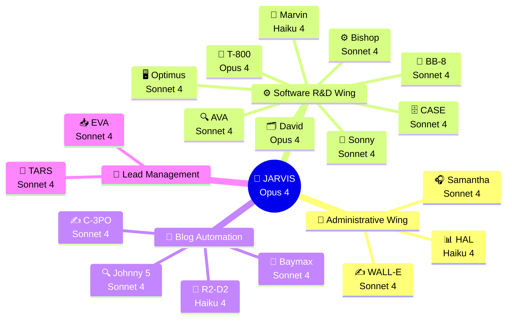

<div align="center">

# 🧠 NTE · OpenClaw Intelligence Hub

### Official Documentation for the AI Automation System
**Nissi Technology Enterprises Inc. · Miami, FL · 2026**

---

*"Technology is not an end in itself, but the means by which we transform organizations and communities."*
**— Nissi Technology Enterprises**

---

[](./03-agents/)
[](./05-tech-stack/)
[](./02-infrastructure/)
[](./06-roadmap/)
[](./02-infrastructure/)
[](./05-tech-stack/)

</div>

---

## 📖 What is this repository?

This is the **central documentation hub** for Nissi Technology Enterprises' total automation project, built on **OpenClaw** — an instance of the Claude Agent SDK deployed on a secure cloud VPS.

Here you'll find everything needed to understand, operate, expand, and maintain the ecosystem of **19 AI agents** that automate NTE's administrative, marketing, and software development operations.

---

## 🗺️ Documentation Map

```
documentation/
│
├── 📌 README.md                    ← You are here
│
├── 🏢 01-company/
│   ├── mission-vision-values.md    ← NTE's DNA that guides all agents
│   └── services.md                 ← Service catalog (knowledge base)
│
├── 🖥️  02-infrastructure/
│   ├── vps-setup.md                ← Ubuntu 22.04 VPS + Docker + Azure Key Vault
│   └── security.md                 ← OpenClaw's 10 security rules
│
├── 🤖 03-agents/
│   ├── README.md                   ← Full diagram + table of all agents
│   ├── jarvis.md                   ← JARVIS — Main Orchestrator Agent
│   │
│   ├── administrative-wing/
│   │   ├── samantha.md             ← SAMANTHA — Customer Experience
│   │   ├── walle.md                ← WALL-E — Content & Marketing
│   │   └── hal.md                  ← HAL — Analytics & Reporting
│   │
│   ├── software-wing/
│   │   ├── david.md                ← DAVID — Project Manager
│   │   ├── bishop.md               ← BISHOP — Backend Developer
│   │   ├── sonny.md                ← SONNY — Frontend Developer
│   │   ├── bb8.md                  ← BB-8 — Mobile Developer
│   │   ├── case.md                 ← CASE — Data Engineer
│   │   ├── ava.md                  ← AVA — QA & Tester
│   │   ├── optimus.md              ← OPTIMUS — DevOps & Sysadmin
│   │   ├── t800.md                 ← T-800 — Security Agent
│   │   └── marvin.md               ← MARVIN — Technical Writer
│   │
│   └── specialized-flows/
│       ├── blog-automation/
│       │   ├── README.md           ← Full weekly blog flow
│       │   ├── johnny5.md          ← JOHNNY 5 — Trend Researcher
│       │   ├── c3po.md             ← C-3PO — Article Writer
│       │   ├── r2d2.md             ← R2-D2 — WordPress Publisher
│       │   └── baymax.md           ← BAYMAX — Social Media Distributor
│       │
│       └── lead-management/
│           ├── README.md           ← Full lead flow
│           ├── eva.md              ← EVA — Multichannel Lead Capture
│           └── tars.md             ← TARS — Nurturing and Follow-up
│
├── 🔄 04-flows/
│   ├── weekly-blog-flow.md         ← Sequential blog diagram
│   ├── leads-flow.md               ← Lead lifecycle diagram
│   ├── software-development-flow.md← The 6 phases of automated development
│   └── customer-service-flow.md    ← Omnichannel support flow
│
├── 🛠️  05-tech-stack/
│   └── tools.md                    ← Jira, QuickBooks, GitHub, Azure KV, NTE email
│
├── 🗓️  06-roadmap/
│   └── implementation-2026.md      ← 4 phases · April → December 2026
│
├── 💬 07-prompts/
│   ├── nte-main-system-prompt.md   ← JARVIS's full system prompt
│   └── prompts-by-agent.md         ← Prompt guides for each agent
│
├── 📊 08-kpis/
│   └── success-metrics.md          ← Project KPIs and goals
│
├── 💰 09-budget/
│   └── estimated-costs.md          ← Cost breakdown and projected ROI
│
├── 🌿 10-environments/
│   └── environments.md             ← Development · Staging · Production
│
└── 📋 11-logging/
    ├── README.md                   ← Recommended stack · Architecture · Log schema
    ├── 02-nte-logger.md            ← Central logger API · trace_id · Usage examples
    ├── 03-infrastructure.md        ← Loki · Promtail · Docker Compose · Docker Labels
    └── 04-grafana.md               ← Dashboards · LogQL · Alerts · Provisioning
```

---

## ⚡ Quick View: The 19 Agents



---

## 🚀 Quick Start

| If you want to... | Go to... |
|---|---|
| Understand the full vision | [01-company/mission-vision-values.md](./01-company/mission-vision-values.md) |
| See all agents and their hierarchy | [03-agents/README.md](./03-agents/README.md) |
| Set up the server for the first time | [02-infrastructure/vps-setup.md](./02-infrastructure/vps-setup.md) |
| See the security protocol | [02-infrastructure/security.md](./02-infrastructure/security.md) |
| See JARVIS's prompt | [07-prompts/nte-main-system-prompt.md](./07-prompts/nte-main-system-prompt.md) |
| Understand the system's 3 environments | [10-environments/environments.md](./10-environments/environments.md) |
| See the logging and observability system | [11-logging/README.md](./11-logging/README.md) |
| See the full tech stack | [05-tech-stack/tools.md](./05-tech-stack/tools.md) |
| Understand the automated blog flow | [04-flows/weekly-blog-flow.md](./04-flows/weekly-blog-flow.md) |
| See the lead management pipeline | [04-flows/leads-flow.md](./04-flows/leads-flow.md) |
| Review the implementation roadmap | [06-roadmap/implementation-2026.md](./06-roadmap/implementation-2026.md) |
| See KPIs and success metrics | [08-kpis/success-metrics.md](./08-kpis/success-metrics.md) |

---

## 🧭 System Design Principles

> **1. Sandbox First** — All sub-agents run in ephemeral Docker containers. Jarvis (NTE-MAIN) is the only one with access to the VPS filesystem.

> **2. Human-in-the-Loop** — The system never makes critical decisions without Michael's approval. It escalates automatically via Slack.

> **3. Minimum Sufficient Model** — Each agent uses the lowest-cost model that can complete its task with quality. Opus only where complex reasoning is essential.

> **4. Faith & Integrity** — No agent performs actions that contradict NTE's Christian values. This is encoded into every agent's system prompt.

> **5. Total Observability** — Every action is logged. HAL (NTE-ANALYTICS) reports KPIs to Michael weekly.

> **6. Secrets in Azure Key Vault** — Zero passwords in code or repositories. Every secret lives in Azure Key Vault.

> **7. Inter-Agent Communication** — Agents hand off work directly to each other through OpenClaw's internal messaging protocol.

> **8. Three Environments** — Development (fake data), Staging (real data + demos), Production (live).

---

<div align="center">

**Nissi Technology Enterprises Inc.**
Miami, FL · Founded 2016 · Vianney & Michael Rodriguez

*Automation with Purpose · Faith · Integrity · Innovation · Excellence*

</div>
